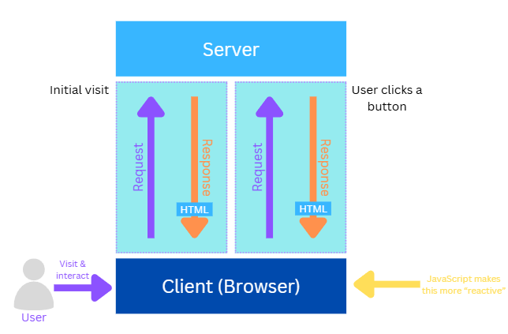

# What is JavaScript?  

JavaScript is like the **magic wand** of web development. It’s a lightweight, flexible programming language that runs in your browser (or even on your computer). It’s what makes websites **interactive** and fun to use. Think of it as the tool that turns a static webpage into a dynamic experience.  

Fun fact: JavaScript was originally called **LiveScript**, but it was renamed to ride the hype of Java back in the day. Don’t let the name fool you—it’s not related to Java at all!  

---

## How Do Webpages Work?  

Let’s break it down step by step:  

### 1. **User Interaction**  

When you visit a website, you interact with it—clicking buttons, filling out forms, or scrolling through menus. Every action you take is a chance for the webpage to respond.  

### 2. **Browser Requests the Webpage**  

When you first visit a site, your browser (the **client**) sends a request to the **server** (a remote computer hosting the website). The server responds by sending back **HTML**, which is like the skeleton of the webpage.  

### 3. **Page Loads in the Browser**  

Once the browser receives the HTML, it builds the webpage and displays it to you. You’ll see text, images, buttons, and other elements.  

### 4. **User Interaction (Clicks, Forms, etc.)**  

If you click a button or submit a form, the browser sends another request to the server. The server processes your action and sends back an updated HTML page. This is why some websites reload when you interact with them.  

### 5. **JavaScript Makes It Dynamic**  

Here’s where JavaScript shines! Instead of reloading the entire page every time you click something, JavaScript can update just the part of the page that needs to change.  

For example:  

- Click a button to show hidden content? JavaScript handles that instantly.  

- Want to see a live preview of your form input? JavaScript makes it happen.  

## Key Points to Remember 📌  

1. **HTML** is the structure of the webpage, and the browser requests it from the server.  
2. Every time you interact with a webpage (like submitting a form), the browser sends a new request to the server.  
3. **JavaScript** steps in to make things dynamic. It updates the page in real-time without needing to reload everything.  

## Visual Representation

The diagram below shows how the browser and server communicate:



This is what makes modern websites so smooth and interactive!  

## Why Should We Care About JavaScript?  

- **Interactive Websites**: JavaScript is behind every cool feature you see online—animations, pop-ups, live updates, and more.  
- **Less Waiting**: By reducing the need for constant server requests, JavaScript makes websites faster and more enjoyable.  
- **It’s Everywhere**: JavaScript isn’t just for browsers anymore. It’s used in mobile apps, servers, and even robots!  

## Final Thoughts  

- JavaScript is the **secret sauce** that turns a boring webpage into an engaging experience. Whether you’re clicking a button, filling out a form, or watching a live update, JavaScript is working behind the scenes to make it happen.  

---

## Variables in JavaScript 🗂️

Think of a **variable** as a container where you can store information. It's like a labeled jar—you can put something inside, close the lid, and later open it to see or change what's inside.

### How to Declare a Variable

```javascript
let name = "John";  // 'let' is used to declare a variable
const age = 25;      // 'const' is used for values that shouldn't change
var city = "New york"; // 'var' is the old way, still used but less common
```

### Types of Variables

1. **Strings**: Text data wrapped in quotes. Example: `let message = "Hello, World!";`
2. **Numbers**: Numeric values. Example: `let score = 100;`
3. **Booleans**: True or false values. Example: `let isOnline = true;`
4. **Arrays**: A collection of items. Example: `let fruits = ["apple", "banana", "cherry"];`
5. **Objects**: A way to store related data together. Example:

```javascript
let person = {
    name: "Alice",
    age: 30,
    city: "London"
};
```

### Changing Variable Values

```javascript
let mood = "happy";
mood = "excited"; // Now the mood is updated to "excited"
```

### Why Are Variables Important?

- They help you **store and manage data**.
- You can **reuse** them anywhere in your code.
- They make your code **dynamic**, just like how JavaScript makes web pages dynamic!

---

## Functions in JavaScript 🔢

A **function** is like a recipe—a set of instructions that tells the computer what to do. Imagine you have a robot, and you give it a recipe card. Every time you want the robot to perform a task, you just hand it the right card. That’s how functions work in JavaScript!

### How to Declare a Function

Here's the simplest way to create a function:

```javascript
function greet() {
  console.log("Hello, World!");
}

greet(); // Calls the function and prints "Hello, World!"
```

### Function with Parameters

Parameters are like placeholders for values you can pass into a function. Think of it as filling in the blanks!

```javascript
function greetUser(name) {
  console.log("Hello, " + name + "!");
}

greetUser("Alice"); // Prints "Hello, Alice!"
```

You can also have more than one parameter:

```javascript
function greetFullName(firstName, lastName) {
  console.log("Hello, " + firstName + " " + lastName + "!");
}

greetFullName("John", "Doe"); // Prints "Hello, John Doe!"
```

### Returning Values from Functions

Sometimes, instead of just doing something, a function will give you a result back. This is called **returning** a value.

```javascript
function add(a, b) {
  return a + b;
}

let sum = add(5, 10); // sum is now 15
console.log(sum); // Prints 15
```

You can also use the returned value directly:

```javascript
console.log(add(3, 7)); // Prints 10
```

### Arrow Functions (A Modern Way)

Arrow functions are a shorter, more stylish way to write functions. They’re especially useful for quick, simple tasks.

```javascript
const multiply = (x, y) => x * y;

console.log(multiply(3, 4)); // Prints 12
```

If your function only has one parameter, you can skip the parentheses:

```javascript
const square = num => num * num;

console.log(square(5)); // Prints 25
```

And if it doesn’t need any parameters at all:

```javascript
const sayHello = () => console.log("Hello there!");

sayHello(); // Prints "Hello there!"
```

### Functions Calling Functions

Functions can even call other functions! This is great for organizing your code.

```javascript
function add(a, b) {
  return a + b;
}

function displaySum(num1, num2) {
  let result = add(num1, num2);
  console.log("The sum is: " + result);
}

displaySum(4, 6); // Prints "The sum is: 10"
```

### Why Are Functions Important?

- **Reusability**: Write code once, use it many times. You don’t have to keep rewriting the same instructions.
- **Organization**: Break complex problems into smaller, manageable pieces. It’s like cleaning one room at a time instead of the whole house at once.
- **Readability**: Makes your code cleaner and easier to understand. Imagine reading a book with clear chapters—that’s what functions do for your code!
- **Modularity**: You can mix and match functions to build bigger, more complex applications.

## Global and Local Variables in JavaScript 🔐🌍

Imagine you have two types of containers for your stuff:

- **Global variables** are like leaving your things on the kitchen table—anyone in the house can see and use them.
- **Local variables** are like keeping your stuff in your bedroom—only you (or people in your room) can access them.

### Global Variables

A **global variable** is accessible from anywhere in your code.

```javascript
let globalVar = "I am global!";

function showGlobal() {
  console.log(globalVar); // Can access globalVar
}

showGlobal(); // Prints "I am global!"
console.log(globalVar); // Also works here
```

### Local Variables

A **local variable** is only accessible inside the function where it’s declared.

```javascript
function showLocal() {
  let localVar = "I am local!";
  console.log(localVar); // Works fine here
}

showLocal(); // Prints "I am local!"
console.log(localVar); // Error! localVar is not defined here
```

### Why Does This Matter?

- **Global variables** are handy, but too many can clutter your code and cause bugs (like leaving stuff all over the house).
- **Local variables** keep things neat and organized, making your code easier to manage.

## Arrays in JavaScript 📋

Imagine an array as a **super-powered shopping list**. Instead of storing just one item in a variable, you can store multiple values inside an array!

### Creating an Array

```javascript
let fruits = ["apple", "banana", "cherry"];
```

### Accessing Array Elements

Each item in an array has a position, starting from **0**.

```javascript
console.log(fruits[0]); // Prints "apple"
console.log(fruits[1]); // Prints "banana"
```

### Changing an Array Item

```javascript
fruits[1] = "blueberry"; // Now the second item is "blueberry"
```

### Adding Items to an Array

Use `.push()` to add an item to the end.

```javascript
fruits.push("grape");
console.log(fruits); // ["apple", "blueberry", "cherry", "grape"]
```

### Removing Items from an Array

Use `.pop()` to remove the last item.

```javascript
fruits.pop();
console.log(fruits); // ["apple", "blueberry", "cherry"]
```

### Looping Through an Array

```javascript
for (let i = 0; i < fruits.length; i++) {
    console.log(fruits[i]);
}
```

### Why Are Arrays Useful?

- They let you store **multiple values** in a single variable.
- You can easily **modify, add, or remove** items.
- Perfect for handling lists of data in JavaScript!
